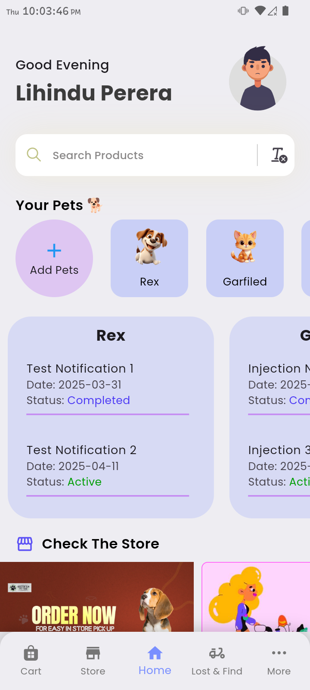
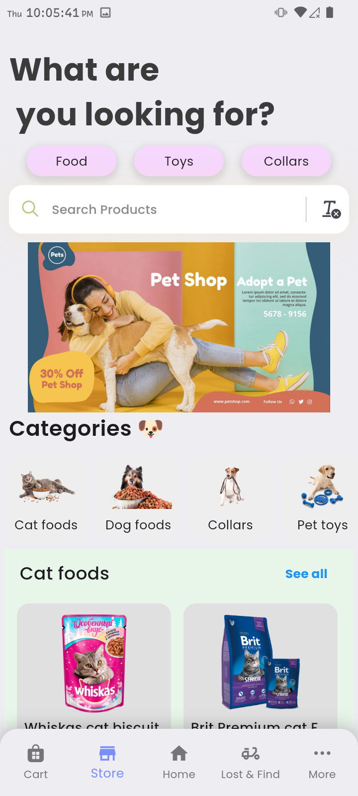
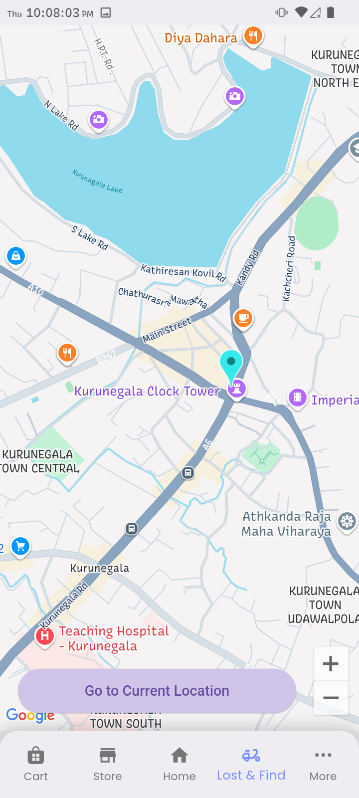
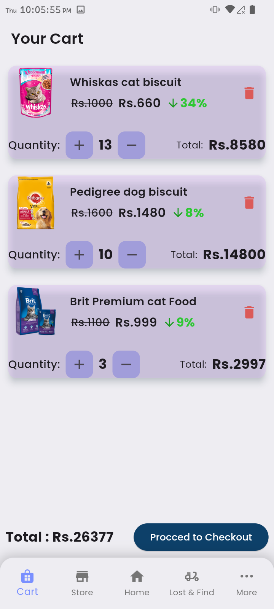
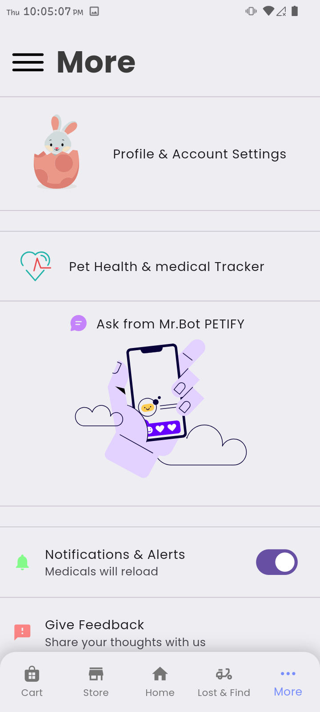

# 🐾 Petify

**Petify** is your all-in-one companion app for pet owners. Whether you're managing pet supplies, setting reminders, tracking healthcare, or locating lost pets, Petify brings everything under one roof. Built with **Flutter** and powered by a **FastAPI + MongoDB** backend, it's designed to be fast, reliable, and user-friendly.



---

## 🚀 Features

- 🛒 **Pet Store**: Browse and purchase pet products directly in-app.
- 📅 **Reminders**: Stay on top of your pet’s daily care and vet visits.
- 🏥 **Health Tracker**: Manage your pet’s health records.
- 🧭 **Lost & Found**: Report or find lost pets in your community.
- 🧰 **More Tools**: Access additional tools to enhance pet parenting.

---

## 📱 Screenshots

| Home | Store | Lost & Find |
|------|-------|-------------|
|  |  |  |

| Cart | More |
|------|------|
|  |  |

---

## 🛠️ Tech Stack

### Frontend
- **Flutter** – Cross-platform mobile development

### Backend
- **FastAPI** – High-performance Python web framework
- **MongoDB** – NoSQL database for flexible data storage

---

## 📦 Installation

### Prerequisites
- [Flutter SDK](https://flutter.dev/docs/get-started/install)
- Python 3.9+
- MongoDB instance (local or cloud)

### Clone the frontend & backend repos
```bash
git clone https://github.com/LihinduPerera/Petify_client.git
git clone https://github.com/LihinduPerera/petify_backend.git
